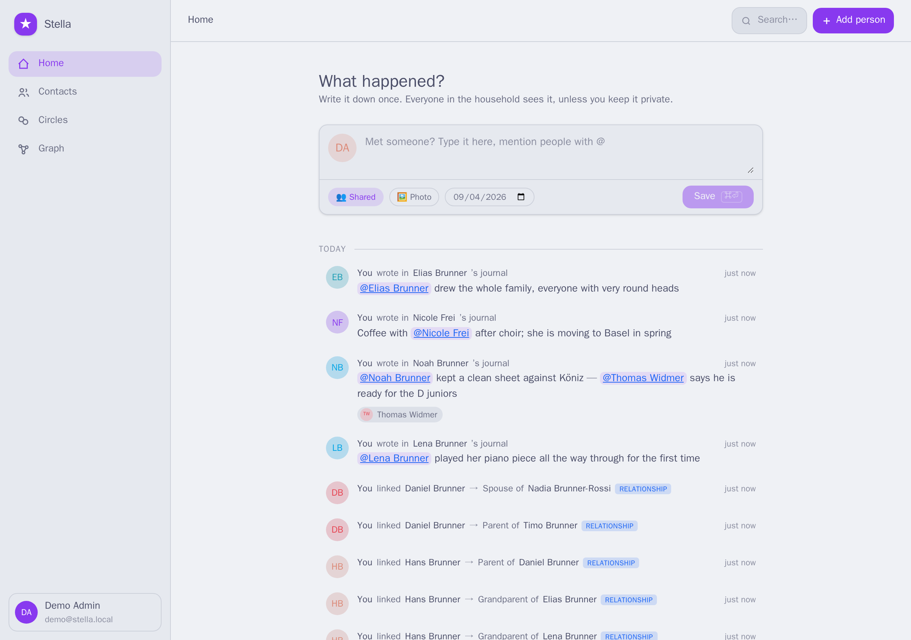
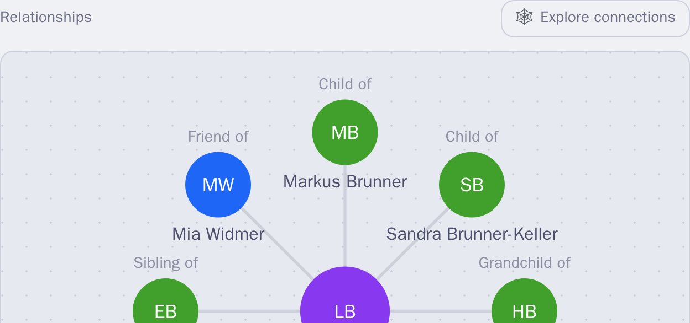
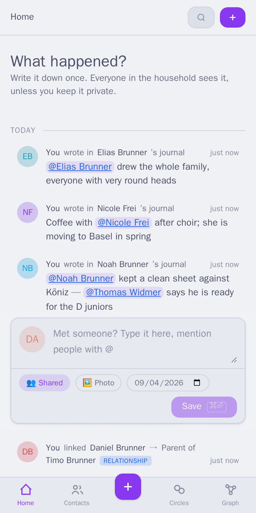
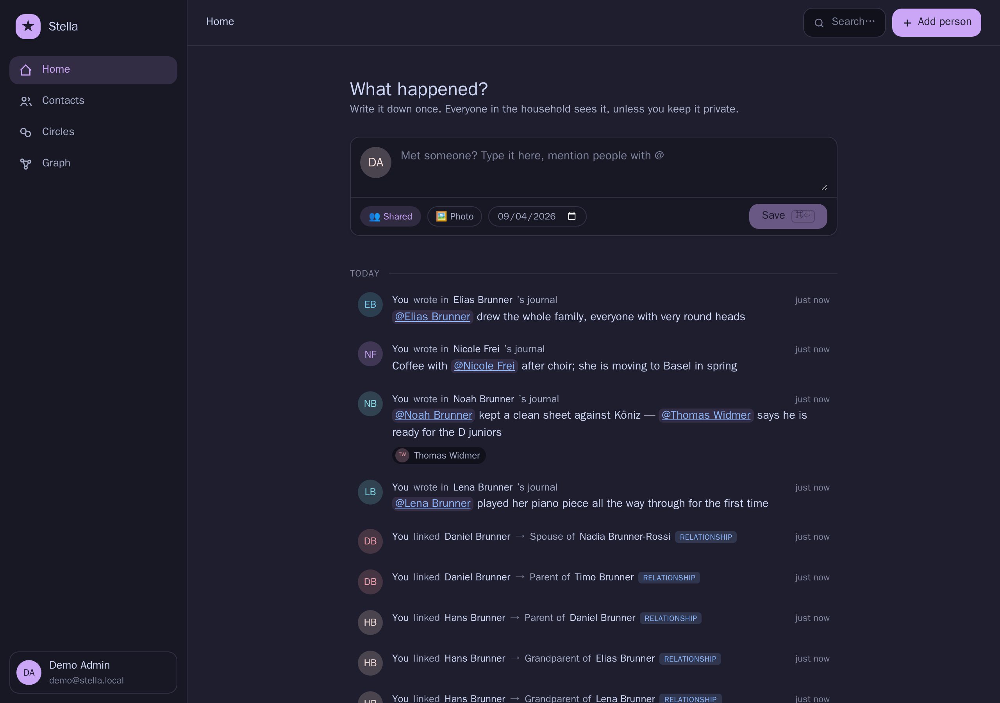

<div align="center">


# Stella

**The people in your life, remembered — together.**

A calm, self-hosted personal CRM for a family. One shared memory of everyone you know,
running on your own hardware, seen by nobody else.

</div>

<br>



<br>

## The idea

Most of what a family knows about the people in its life never gets written down. Who
Lena's best friend is. That the neighbour is moving in spring. Which of the kids' teachers
is which. It lives in one person's head, and it fades.

Stella is a single, quiet place to put those things — and it asks for almost nothing in
return. You write one sentence, mention the people in it, and you are done. Everyone in
the household sees it, unless you decide otherwise.

It is a lighter, warmer alternative to [Monica](https://github.com/monicahq/monica):
fewer screens, no forms to fill before you can save a thought, and built for a household
rather than a single user.

## What it feels like

**Write it down in one sentence.** The first thing on the home screen is a text field, not
a dashboard. Type what happened, mention people with `@`, press save. Someone you mention
who isn't in Stella yet is created on the spot — no detour, no empty form.

**One household memory.** Everything anyone writes is shared with the family by default,
so nobody has to relay news twice. Anything can be made private with one tap, and private
stays private — including the people you add privately.

**See how everyone connects.** Every person carries their own little constellation: who
they belong to, who they grew up with, who they play football with.



**Circles for the contexts people share.** A class, a team, a choir. People come and go
from them over the years, and Stella remembers who was there when.

**A journal per person.** Small entries, one day at a time, so you can look back at a
whole year with someone.

**Made for the phone too.** The capture field sits above your thumb; the rest of the app
gets out of the way.

<div align="center">

</div>

**Light and dark, both done properly.**



## Yours, on your own hardware

Stella is one small container and one file. It runs happily on a Raspberry Pi, a NAS or an
old laptop in a cupboard. There is no account to create with anyone, no telemetry, and
nothing leaves the machine you put it on. Back it up by copying a folder.

```sh
git clone https://github.com/polandy/Stella.git stella
cd stella
cp .env.example .env      # set SESSION_SECRET and STELLA_URL
./deploy.sh               # builds and starts it; open http://localhost:3000
```

The [installation guide](docs/install.md) walks through it properly, including running it
behind your own domain and signing in with your existing single sign-on.

## Documentation

**For everyone**

- [Installation & first run](docs/install.md) — get Stella running and keep it running.
- [Using Stella](docs/using-stella.md) — moments, people, privacy, circles, the journal.

**For contributors** — the specification suite the project is built from:
[vision](docs/01-vision-and-scope.md) ·
[features](docs/02-features.md) ·
[data model](docs/03-data-model.md) ·
[architecture](docs/04-architecture.md) ·
[design system](docs/05-ui-design-system.md) ·
[roadmap](docs/06-roadmap.md) ·
[deployment reference](docs/07-deployment.md) ·
[coding guidelines](docs/08-coding-guidelines.md)

## Where it stands

The core loop is in place: add people, relate them, find them, and capture moments into a
shared household stream. Important dates, a photo gallery and an import from Monica are
next. See the [roadmap](docs/06-roadmap.md).

<div align="center">
<sub><em>stella</em> — Latin for “star”. Every person is one; their relationships are the constellations.</sub>
</div>
